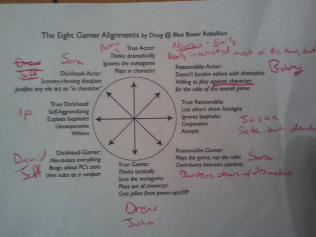

# Change

One summer in high school I was a lifeguard at a local golf club pool and a sweet job it was. Above minimum wage pay, half-off at the snack bar and best of all, almost no one ever came to the pool. So I got paid to sit in the shade and read the Dungeons & Dragons 3rd Ed. Player's Handbook. The small morsels of synergy bonuses and rules lawuering I tasted with WotC d20 Star Wars became a Tony Montana gorge in D&D.

I finished high school as my regular group's defense attorney to Dooley's Chief Prosecutor (mostly because he was more often the Dungeon Master). I got all of the floppy books to find optimum weapon and class combinations. Every level of progression was mapped out before I rolled my first check. The game centered around maximizing numbers: XP, attack bonus, damage, gold...

After a bit of a hiatus I found a new group in my third year at college. I had my dice, some limewire bootleg copies of the revised PHB (3.5 Ed) and a desire to get back to the glory of the game. And a lot of the old habits were still there. A little rusty at first, what with the (slightly) revised rules and new supplements I had yet to look through but it all came back to me.

Exhibit A, one of the players in the extended gaming group decided to classify all of us:

*True Gamer*  
*Thinks tactically*  
*Sees the metagame*  
*Plays out of character*  
*Gets jollies from power-ups/XP*

And I played that way...

...but with a half-elf ranger.

Non-gamer Sidebar: That previous sentence probably made no sense to you but for context, in 3.5 Ed. half-elf was considered by far the worst of the possible character races one could choose from in the PHB. Choosing to play a half-elf was like deciding run in a race with a 50 lb. pack. You could finish (not die) but it wasn't going to be pretty (probably get knocked out).

Looking back that was the beginning of the change for me. Choosing a sub-optimal race purely for a story decision should have been a red flag. The next major character I played after that was a nobleman fighter whose second highest stat was in Charisma (another sign of lapse in efficiency).

The small aberrations grew in a positive feedback loop until focused soley on maximizing narrative drama and looking for systems that would let me. Fate, Dread, a whole slew of Powered by the Apocalypse games (Gamer Sidebar: can we not come up with better way to describe these games? PbtA just looks wrong and sounds so much worse).

I returned to that half-elf ranger a couple of more times in other systems. He met his final fate in a game of Dungeon World, dying defending his people from the Red Hand. The final blow that killed him did so by just one hit point. When the spectre of death offered to revive me if I helped the Red Hand, I punched the devil in the face before succumbing to the final darkness.

As were sittig around the table after the session I realized that I had not taken into account my damage reducing armor in each of the attacks that led to my death. I hadn't been dropped to zero, I had 3 HP remaining. The math of the game said I hadn't died.

I didn't say anything.