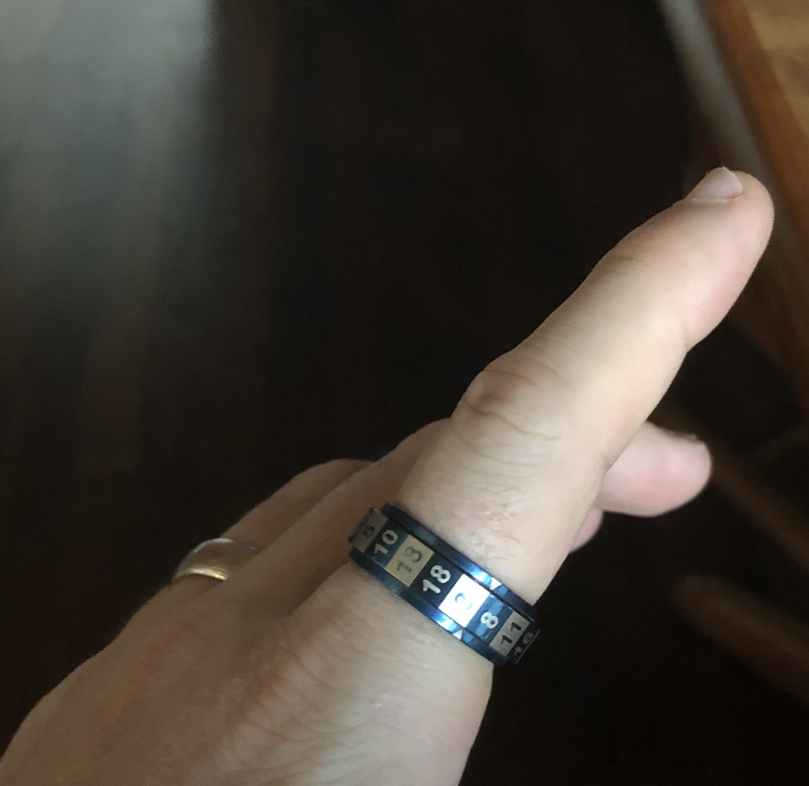
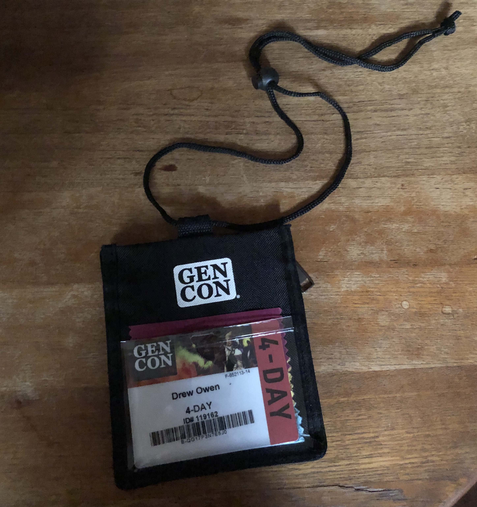
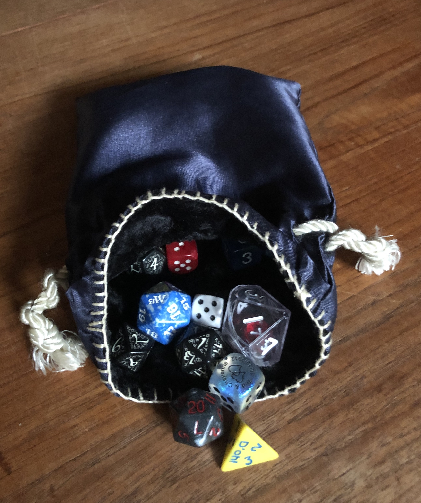

# Thread

Lets talk *accessories!*

You might not know it but gamers know how to accessorize. 

Rings...

... check.

Something for the neckline...

...but of course darling.

But the one item no gamer can go out on the town without...

... the dice bag.

More than just cloth and thread, you can tell a lot about a gamer from their dicebag. 

Small dice bag? Not a regular game master, if ever. 

Tons of d10's (formally known as [pentagonal trapezohedron](https://en.wikipedia.org/wiki/Pentagonal_trapezohedron))? White Wolf player. 

Leather pouch? Good odds they own a kilt.

Used Royal Crown dice bag? Either underage or already a parent.

Oh and if they don't have a dice bag and still carry their dice around in that hard plastic prism? New to the hobby, be kind to them. And get them a proper dice bag.

#rpgaday2020