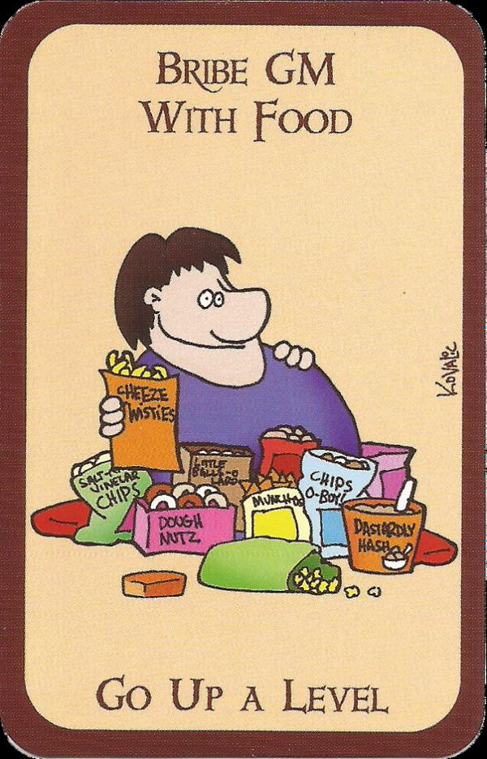

# Tribute

Let's talk about snacks. 

Snacks are an important part of a game night. The salty snacks give enough savory to let you skip a meal and the sweet ones power you through. I love snacking with my games but for the love of [Correllon Larethian](https://forgottenrealms.fandom.com/wiki/Corellon) can we please just do it right?

There is a trope that the official snack of gaming is Cheetohs (or Doritos, depending on who you ask). I have been gaming for almost 20 years and I have hate having that powder on my hands. Can we all agree that it is messy and unsanitary and should be avoided if for nothing else than health and safety reasons?

If one must arrive at game night with a (rightly deserved) tribute for the game master lets try to keep it clean. Pretzels, carrots, Peanut M&Ms (or Cadbury Mini-Eggs if your wife doesn't eat them all before you get the chance to have any). This is the fuel of true legendary warriors. 

#rpgaday2020

