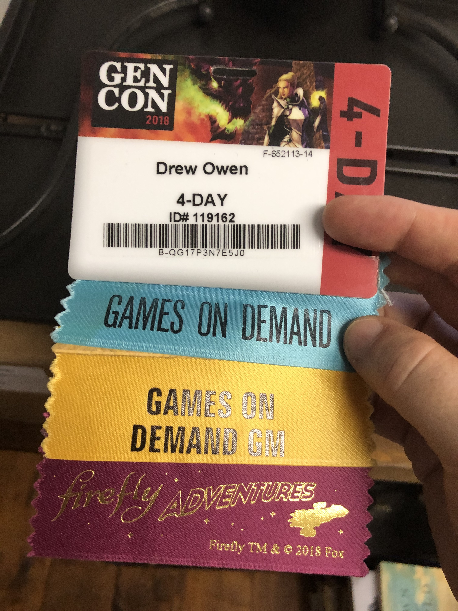

# Banner

So a fun little bit of con attire: the badge flags.

You can find them all over the con, at various booths. They act like little banner ads (case in point the Firefly Adventures flag) but can also represent your street cred (my Games on Demand and Games on Demand GM flags mark me as an indie gamer). Some of them are prizes for placing at various levels of a tournament. I think some people go to the con just for the purpose of collecting these flags: I swear I have seen lines of flags a yard long.