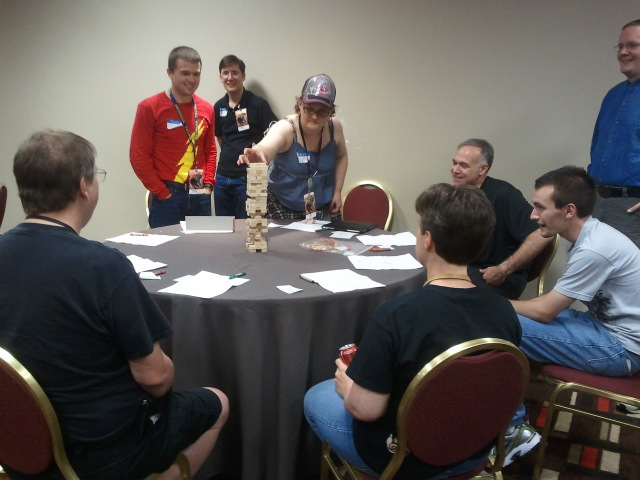

# Tower

I would even argue, that playing pretend is the most universal child's game in the world. Example: My dad was stationed in the Netherlands when I reached school age and we lived off-base so I actually attended a locul Dutch speaking school. My mom was worried about how I was making friends on the playground and asked me if it was hard because I didn't speak much Dutch. According to her my reply was "It isn't hard Mom. I just go out to the middle of the playground and yell 'GI JOE!'". And I do have a memory of me and other Dutch kids playing pretend with shovels as rifles.

At it's heart, roleplaying games are really just a game of pretend. We are playing with our imagination just as we did as kids on the playground but we just need to be able to resolve whether or not something happened because we are adults now and needing something more than: "I got you!"; "No you didn't, I had my force field up!"; "CHEATER!".

Beyond that there isn't any real requirement. While the classic resolution mechanic is dice (portable, universal, only requires basic math), there is no rule that requires them (other than the fact that dice are shiny and cool). The resolution method can literally be anything. This is an image of me playing in a roleplaying game at DragonCon 2012:

Yes, that is a Jenga tower in the middle of the table. This is a horror-themed roleplaying game called Dread. When a player attempts an action narratively dangerous, the Gamemaster declares a number of bricks and tells you to pull and place that many. There are probably some more rules than that but I have seen the book and it ain't that long. If the tower falls...you die. Last player left alive wins. Also, if you bump the table and knock the tower you die as well so over the course of the game more and more of the players tend to lean back from the table. 

No math, no character sheets beyond what you need to keep track of who you are and everyone already knows how to play Jenga (or can learn in about 20 seconds). What a lovely way to play pretend.