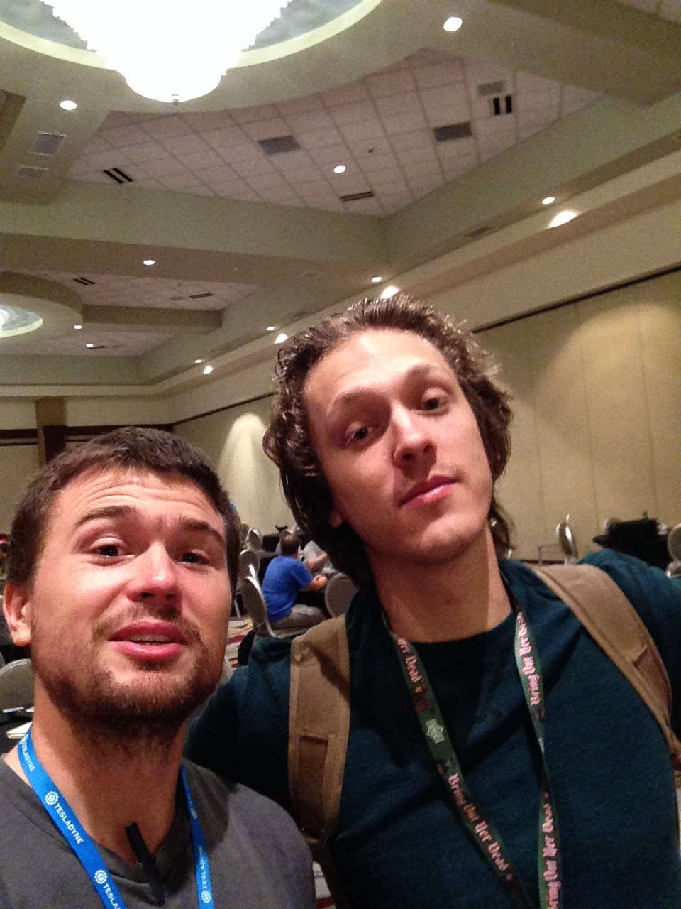

# Lever

So another small digression, my favorite game of GenCon 2015. I found this game at Games on Demand (because that is pretty much all I play at GenCon). The game used the Leverage Roleplaying Game (the pdf does not appear to be for sale anymore but I encourage finding a copy) system to tell a Robin Hood adventure. The game was a brilliant marriage of setting and rules and even if the GM (pictured below with me) was a little iffy at spots on the rules, the flow and tenor was excellent. I came to find out later he also has a [website](http://bettermyths.com) where he re-tells mythological tales in a more modern vernacular, including a bunch of Robin Hood myths.

#rpgaday2020

