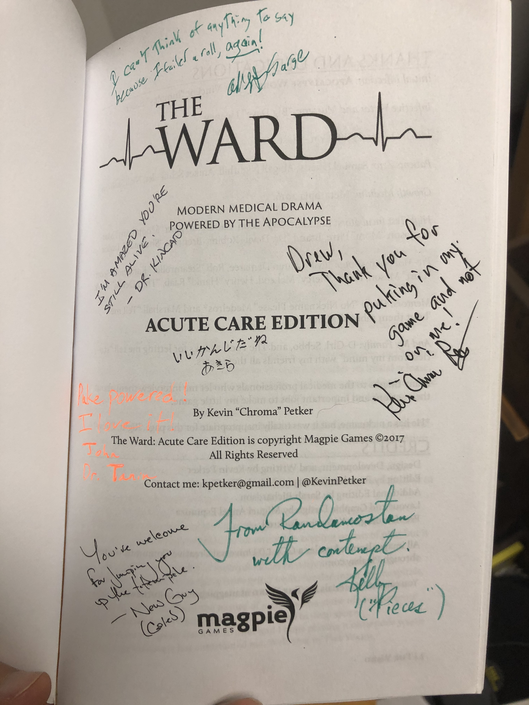

# Favor

Con games are an interesting aspect of gaming. I have mentioned previously how I like con games. And usually they are one-night stands: fun, short, and never see them again.

But not always.

Sometimes a group of people sit down to the table and they all find that magical wavelength. The closest analogy I can make is it is like a sports team where everyone is running support lines and looking for the assist rather than trying to do something individually cool. Players at the table read where the other is going and set them up to make it even more brilliant. No one hogs the spotlight, everyone is invested in both their characters and everyone else's. The word synergy is a trite business term but I have seen it happen at the table.

It can happen occasionally. Once at GenCon, a raucous Saturday night group playing Dungeon World. At DragonCon, a core group of us from across the country that have self-assembled into a mini-cabal, with only certain players given the tap and invitation to join. 

The best time it happened though might have been Dreamation 2017. Now the table was not technically all strangers, I was there with my friend John ([previous](11-stack-DO.md) [appearances](02-change-DO.md)) but the game and everyone else was new, [The Ward](https://www.drivethrurpg.com/product/222793/The-Ward-Acute-Care-Edition). The game was brilliant, the players invested...words fail me in capturing the emotion of the game. It was entirely make believe but the emotions are so real even today. 

The session was centered around us as doctors working at an aid hospital in a war-torn country, the work-up is called At the Sharp End. I have run The Ward since that game but I haven't brought myself to run that particular setting. I am scared that I won't live up to the memory of that first game. I was so hyped after the game that I had to go to a nearby bar for a beer to calm me down.

That pick-up con group continued to play for several more sessions online, and for two more years after that initial game. At one of those sessions, we all bought copies of the ashcan and started signing them like yearbooks. It is a treasured memento that I will hold onto forever.

#rpgaday2020