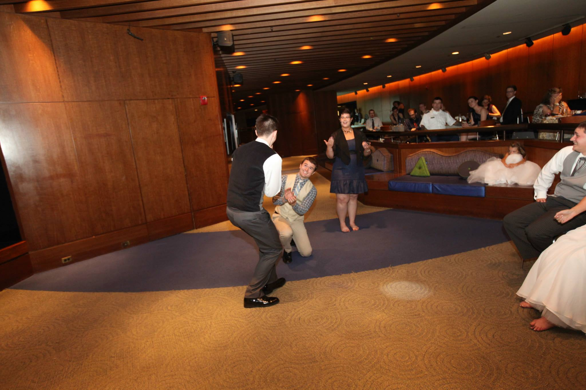

# Ride

Summer 2013 I got curious about GenCon. I was still in grad school and thus had time but little cash on hand. On a random note I looked up the drive to Indianapolis from Atlanta and was shocked to see it was only about 8 hours (in mind everything north of Kentucky was the other side of the moon). I was even more surprised to see that a little less than halfway to GenCon was a little town called Manchester, TN, where John was located. 

I texted John and brought up the situation: I could drive up Wednesday night after work, then we could both head over Thursday morning and do the con weekend. He was tempted but had another social even that weekend. But he wasn't that close to them...he got back to me a day or so later that he was in. Thus our planning began.

We found a cheap hotel and then just jumped in feet first. We didn't prep too much and just went to take it all in. And since it was just the two of us we stayed attached at the hip pretty much the entire weekend. And it was glorious.

Since that first trip, going to cons has kind of become a thing we do. We plan our weekend around playing in the same games as he shares my penchant for trying new games and systems. Even if the game isn't great John and I will find a thing we like about the story or our characters and then lean into that to generate our fun. 

But I also really enjoy our rides to the cons. It is usually just the two of us, in a car, on a bus or a train; and we get to just talk, about games, life, love, relationships, careers, politics, children. I look forward to those rides together almost as much as the con itself.

Our gaming arcs mirror each other. Eagle-eyed readers will recognize his name popping up often in this collection. He was the other True Gamer in that alignment [chart](02-change-DO.md). He was the Gamemaster in that next game I played in, with the fighter with a high Charisma. Starting then I could the change coming in John, his strong emphasis on character background and motiviatons (he had a four page form he wanted us to fill out during character creation with prompts and question about our characters). The end of that game coincided with our graduations, everyone ready to go their separate way. I remember after the last session as I was getting ready to leave, John shaking my hand and looking me in the eye. I don't recall exactly what he said but in my memory he was thanking me for playing, giving me a sign of respect for what I brought to the game.

John left Atlanta for a few years before coming back to finish up a second bachelors degree (something we have in common is an abundance of higher learning). I ran into him randomly at the gym at Georgia Tech and he invited me to play in a new Rennaissance-era heist [game](11-stack-DO.md) he was putting together. And when I was putting together my Spirit of the Century [game](28-close-DO.md) he was the first person I reach out to (and even scheduled the first session around his schedule).

I mentioned [previously](07-couple-DO.md) that I tend to have a roleplaying boyfriend. I might go so far as to call John my gaming husband. I mean, I did propose to him.

Explanation: we were both at our mutual friends' wedding. The DJ/MC was talking to our table when the maid of honor mentioned the entire plan around the groom's popping of the question was kind of a whole ordeal. The DJ then said something like "This seems like the right table to help tell that story." John and I locked eyes knew what we were going to do without a word. Anna got the microphone and went to the front to narrate, while John and I pantomimed the entire story in real time.

John then played with this some more in the lead up to my own wedding. It happened at GenCon three years later (beacause of course it did), our group of friends went out to a now traditional Saturday night dinner but that night it was doubling as a mini-bachelor party/celebration. The place was swanky with a a small band and jazz singer. I felt a need to tuck in my shirt when we got there. We had a nice dinner when John leaned over to me and said something cryptic like "I hope you enjoy this", then he got up from the table and went to the microphone on the stage. 

He then gave a speech about how how tough it had been the past few years in a long-distance relationship for three years after I proposed to him, how he was so happy that it was all finally coming to a close. I stood partway through the speech, mostly out of incredulity at what he was doing. He closed with an "I love you" and came back to me. I grabbed him by the cheeks and kissed him. People came by the table and had nice things to say, how they had to deal with tough relationship times as well. At the time I felt bad that we hoodwinked these people but looking back I am not sure we did. My eyes might have been welling up during his speech with a little embarassment but really the look in my eyes was love.

#rpgaday2020